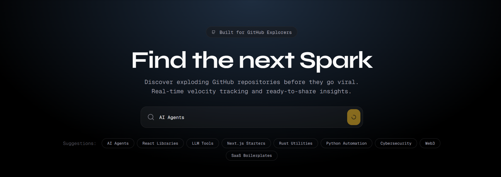

# VelocityHunt ⚡️

> **Discover exploding GitHub repositories before they go viral.**
> Instant insights, velocity-based ranking, and ready-to-share social posts.

[](https://x.com/velocity_hunt)



## 🚀 Overview
Most "trending" lists are lagging indicators. By the time a repo hits the front page, you've already missed the opportunity to be an early adopter or contributor.

**VelocityHunt** is built for makers who want to stay ahead of the curve. We don't just look at absolute star counts; we track **Spark Velocity**.

- **Velocity-First**: We prioritize repos gaining momentum *now*, even if they only have 100 stars.
- **Topic Deep-Dives**: Filter by your specific interests—from "AI Agents" to "Rust Tooling".
- **Built for Virality**: Find a spark? Share it with your audience in one click with our pre-formatted social drafts.

## ✨ Features
- **🔥 Trending Topics**: Smart suggestions for high-growth areas when you're looking for inspiration.
- **⚡️ Spark Score**: A proprietary algorithm `(Stars * 2 + Forks) / Days_Live` with decay factors for inactivity.
- **🛡️ Resilient Architecture**: 3-layer caching (Memory + Supabase + Stale-while-revalidate) to survive the most intense traffic spikes.
- **📱 Mobile Optimized**: A premium, responsive UI built for discovery on the go.
- **🎨 Modern Aesthetics**: Dark mode, glassmorphism, and smooth animations using Framer Motion.

## 🛠 Tech Stack
- **Framework**: Next.js 16 (App Router)
- **Styling**: Tailwind CSS 4 + Framer Motion
- **Database**: Supabase (Postgres) + Drizzle ORM
- **Deployment**: Vercel

## 🏁 Getting Started

### 1. Clone & Install
```bash
git clone https://github.com/Ouranos27/velocityhunt.git
cd velocityhunt
bun install
```

### 2. Configure Environment
Copy `.env.example` to `.env.local` and add your credentials:
```bash
cp .env.example .env.local
```
Required variables:
- `DATABASE_URL`
- `GITHUB_TOKEN` (Optional, prevents rate limits)

### 3. Run Locally
```bash
bun dev
```
Visit `http://localhost:3000`.

## 📜 License
MIT © Philippe

---
